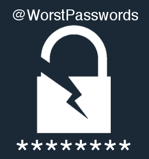

### 21 Feb 2018

### If the bot tweets one of your passwords, __*change it*.__   
This is not the moment to say "*haha that is so me!*" and just like the tweet. It means you are at an increased security risk.

## Overview
With the release of [ProbableWordlists V2](https://github.com/berzerk0/Probable-Wordlists/releases/tag/v2.0), we have a more accurate, evidence-based list of the world's most common passwords. The aim of the ProbableWordlists  project is to discourage the use of today's common passwords. People need to be warned what passwords are too risky to use.

[@WorstPasswords](https://twitter.com/worstpasswords) is a Twitter bot designed to do just this. Twice a day, it tweets a password from the list of the [Top __747__ Most Common Passwords](https://raw.githubusercontent.com/berzerk0/pastehost/master/Top747-probable-v2.txt).
If someone witnesses the bot announcing their "secret" password, they may be driven to changing it to something far more secure. Hopefully, the bot will inspire them to take the first step towards a more security-minded internet presence.

## Operation

It's really a simple bot, here is the entire workflow.

1. Is it time to post?
2. Okay, pick a file to read from.
3. Pick a random line from that file.
4. Tweet a post based on that line.
5. Wait until the next time to post.

It is incapable of querying any online lists or responding to mentions or direct messages. All it can do is tell time, pick numbers, and tweet.

Statistically, the top 25 passwords on the list are far, far more common than the bottom 747. However, a bot that only posts 25 passwords isn't very useful. Therefore, I tried to strike a balance between tweeting the the top 25 and the bottom 722 passwords.

I accomplished this by including a "coin flip" concept, albeit using a very weighted coin.

* __20%__ of the time, the bot picks from the list of the __Top 25__ entries
*  __80%__ of the time, the bot picks from the __Bottom 722__ entries.

This way, the bot pulls from a large enough pool of possibilities to have variety, but the passwords that are the most common are weighted to appear more often than those that don't.

## 747 Is A Weird Number. Why not 750?

The concept of "the Nth most common password" is fuzzy - there are ties, you know. Some passwords are equally common. This is why the tweet's don't say "this is the world's Nth most popular password."

If you are perusing the Probable Wordlists and suddenly see a section in obvious alphabetical order, you are seeing passwords that are all equally likely.

However, instead of tweeting out every single password from say, the 15th most common slot, the bot simply chooses one from the top 747 entries on the list.

Each one of the passwords in the bot's pool appeared at least 206 times in Probable Wordlist V2 analysis. This is unrelated to the fact that the smallest ProbableWordlist is 207 lines long - it is just a funny coincidence.

## Password Reuse Warning

Using a common password is risky, but it is even more common to re-use passwords across accounts. I am very careful to say *"one of your passwords"* as opposed to *"your password"* for exactly this reason. __Do not reuse passwords across accounts.__

__Do not reuse passwords across accounts.__

Unique passwords can mean the difference between someone listening to music your Spotify and writing emails in your named, gaining access to your bank account and posing as you to ask your Facebook friends for money.

This warning is possibly more important than awareness of the most common passwords - I had to include it.

 
__Follow [@WorstPasswords](https://twitter.com/worstpasswords) to help remember the most common passwords on the planet!__  

Please share to spread awareness and increase security.
 

## Thanks for reading!

 
